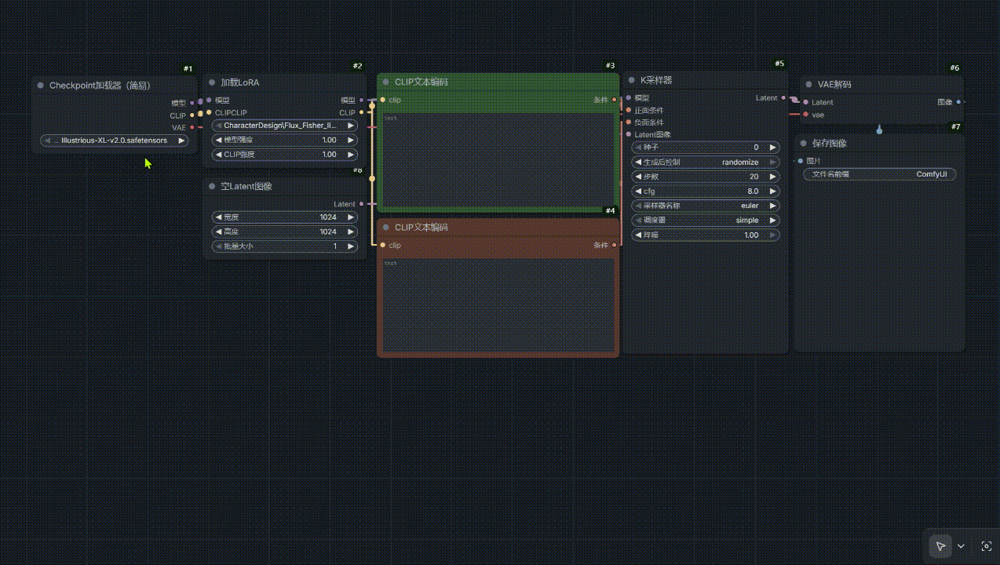

# ComfyUI Model Preview Hover

[中文说明请向下滚动 (Scroll down for Chinese version)]

## 📖 Feature
Automatically displays a preview popup of the model's cover image when hovering the mouse over the model name in the dropdown menu.
Supported nodes: **CheckpointLoader, LoRA Loader, UNETLoader, ControlNetLoader, etc.**

## 🚀 Usage
1. Ensure you have a cover image file with the **same name** as your model in the corresponding model folder (e.g., `models/checkpoints/`).
   - **Supported formats**: `.png`, `.jpg`, `.jpeg`, `.webp`
   - **Example**: If your model is `flux_dev.safetensors`, your preview image should be named `flux_dev.png`.
2. Refresh the ComfyUI webpage to apply changes.

## 📦 Installation

### Method 1: ComfyUI Manager (Recommended)
1. Search for "ComfyUI Model Preview Hover" in ComfyUI Manager and install it.
2. Restart ComfyUI.

### Method 2: Manual Installation
1. Navigate to your `ComfyUI/custom_nodes/` directory.
2. Clone this repository:
   ```bash
   git clone https://github.com/gxwprince/ComfyUI_Model_Preview.git
3. Restart ComfyUI.


## 中文说明
ComfyUI Model Preview Hover (模型悬停预览插件)
## 📖 功能
在 Checkpoint、LoRA、UNET、ControlNet 等加载器的下拉菜单中，当鼠标悬停在模型名称上时，自动在侧边弹窗显示该模型的封面预览图。
## 🚀 使用方法
1. 确保你的模型文件夹（如 models/checkpoints/）内有与模型同名的封面图。
   - **支持格式**：.png, .jpg, .jpeg, .webp
   - **举例**：如果模型文件名是 flux_dev.safetensors，对应的封面图应命名为 flux_dev.png。
2. 刷新 ComfyUI 网页即可生效。
## 📦 安装
### 方法 1：通过 ComfyUI Manager (推荐)
1. 在 ComfyUI Manager 中搜索 "ComfyUI Model Preview Hover" 并安装。
2. 重启 ComfyUI。
### 方法 2：手动安装
1. 进入 ComfyUI/custom_nodes/ 目录。
2. 克隆本项目：
code
Bash
git clone https://github.com/gxwprince/ComfyUI_Model_Preview.git
3. 重启 ComfyUI。


